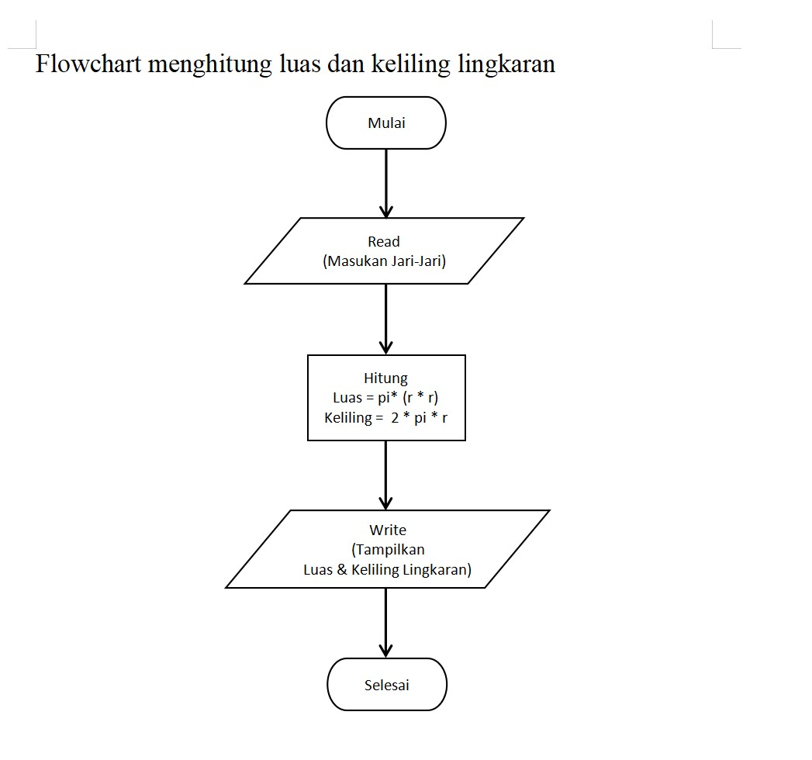
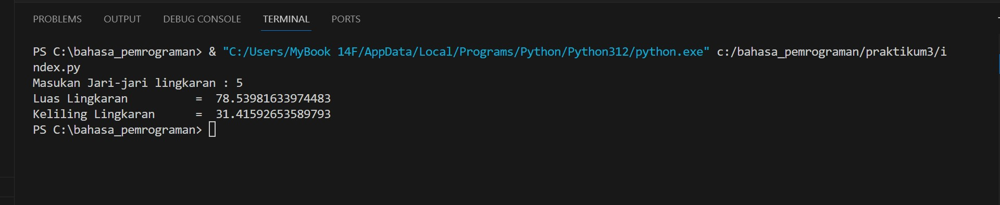
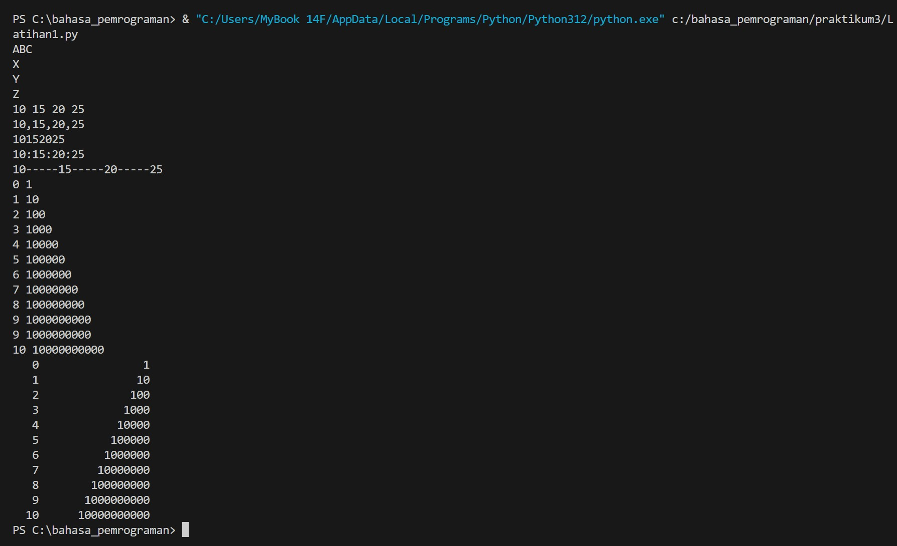

# Praktikum 3
# Flowchart


## menghitung luas dan keliling lingkaran menggunakan Python

* Membuat kode program untuk
menghitung luas dan keliling
lingkaran

````
jarijari = float(input("Masukkan jari-jari lingkaran: ")) 
# kode meminta pengguna untuk menginputkan jari jari

luaslingkaran = 3.14 * jarijari**2  
# kode rumus luas lingkaran

kelilinglingkaran = 2 * 3.14 * jarijari 
# kode rumus keliling lingkaran

print("Luas lingkaran adalah: ", luaslingkaran)
# kode untuk menampilkan hasil luas lingkaran

print("Keliling lingkaran adalah: ", kelilinglingkaran)
# kode untuk menampilkan hasil keliling lingkaran
````
## Maka hasilnya


### Latihan 1

    # penggunaan end
    print('A', end='')
    print('B', end='')
    print('C', end='')
    print()
    print('X', end='')
    print('Y', end='')
    print('Z', end='')

    # Penggunaan separator
    w, x, y, z = 10, 15, 20, 25
    print(w, x, y, z)
    print(w, x, y, z, sep=',')
    print(w, x, y, z, sep='')
    print(w, x, y, z, sep=':')
    print(w, x, y, z, sep='-----') 

    # string format
    print(0, 10**0)
    print(1, 10**1)
    print(2, 10**2)
    print(3, 10**3)
    print(4, 10**4)
    print(5, 10**5)
    print(6, 10**6)
    print(7, 10**7)
    print(8, 10**8)
    print(9, 10**9)
    print(10, 10**10) 
 
    # string format
    print('{0:>3} {1:>16}'.format(0, 10**0))
    print('{0:>3} {1:>16}'.format(1, 10**1))
    print('{0:>3} {1:>16}'.format(2, 10**2))
    print('{0:>3} {1:>16}'.format(3, 10**3))
    print('{0:>3} {1:>16}'.format(5, 10**5))
    print('{0:>3} {1:>16}'.format(6, 10**6))
    print('{0:>3} {1:>16}'.format(7, 10**7))
    print('{0:>3} {1:>16}'.format(8, 10**8))
    print('{0:>3} {1:>16}'.format(9, 10**9))
    print('{0:>3} {1:>16}'.format(10, 10**10))
* penggunaan end, berfungsi untuk menjadikan dua line print berbeda menjadi 1 baris yang sama
* penggunaan separator, berfungsi untuk memisahkan argumen, fungsi sep digunakan untuk memberi kesamaan tanda pemisah
* string format, berfungsi untuk format int menjadi string atau format suatu nilai dan memasukkan nilai ke dalam pengganti string{}
### Ouput

### Latihan2

    a=input("masukkan nilai a:")
    b=input("masukkan nilai b:")
    print("Variable a=",a)
    print("Variable b=",b)
    print("Hasil penggabungan {0}&{1}={2}".format(a, b, a+b))

    # konversi nilai variable
    a=int(a)
    b=int(b)
    print("Hasil penjumlahan {0}+{1}={2}".format(a, b, a+b))
    print("Hasil pembagian {0}/{1}={2:.2f}".format(a, b, a/b))

* input a&b = menginput nilai yang diminta untuk variabel a&b
* print("variable a=", a) & ("variable b=", b) = mengeluarkan output text dan memanggil nilai yang telah di input
* a=int(a) & a=int(b) = mengubah string menjadi integer guna menyelesaikan operasi matematika
* format = digunakan menggabungkan string dengan variabel integer
* {2:.2f} = menghasilkan output maks 2 bilangan setelah koma (.)
### Latihan3

    print('##  Program Python Belah Ketupat Bintang  ##')
    print('Hello ini script python')
    print('============================================')
    print()
 
    lebar_belah_ketupat = int(input('Input lebar belah ketupat: '))
    print()
 
    for i in range(lebar_belah_ketupat):
      for j in range(lebar_belah_ketupat-i):
        print(' ',end='')
     
      for k in range(i+1):
        print('* ',end='')
      print()

    for i in range(1,lebar_belah_ketupat):
      for j in range(i+1):
        print(' ',end='')
     
      for k in range(lebar_belah_ketupat-i):
        print('* ',end='')
      print()

*  for i in range(lebar_belah_ketupat) = untuk mencetak loop bagian atas belah ketupat sebanyak input
*  for j in range(lebar_belah_ketupat-i) = untuk mencetak sebelum bintang setiap baris
*  for k in range(i_+1) = untuk mencetak loop bintang 
*  for i in range(1,lebar_belah_ketupat) = loop kedua mencetak bagian bawah belah ketupat. Loop ini juga akan berjalan  for j in range(lebar_belah_ketupat-i) kali.
*  for j in range(i+1) = loop mencetak spasi sebelum bintang bagian bawah
*  for k in range(lebar_belah_ketupat-i) = loop mencetak bintang pada setiap baris bagian bawah
